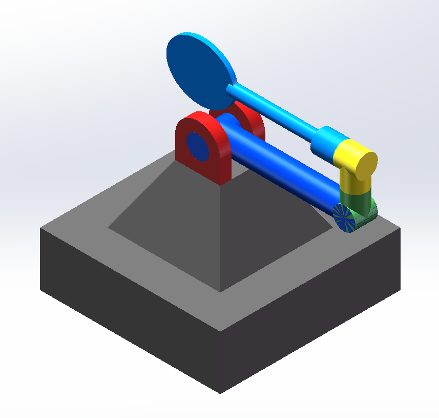

# FightingRobotSimulation
**Multi-functional Fighting Robot Simulation on PyBullet**

This repository is base on the Multifunctional-Fighting-Robot developed by HMIS, Shandong University, which could achieve tennis, badminton and table-tennis competition with human.

I simplified the robot and re-modeled in SolidWorks, exported the urdf files. And then imported PyBullet for simulation and emulation.

According to the simulation in PyBullet environment, the forward and inverse kinematics of the robot are proved to be correct.

20230511 Generate kinematics matrix from end-position and end-posture
* Solve some bugs in kinematics to adapt our real robot

20230505 Optimize forward and inverse kinematics
* Use parameters instead of specific numbers

20230424 Optimize file structure
* Submit 3D model and images

20230423 Add picture description
* Optimized 3D model
* Add picture description to README.md

20230420 Kinematics recheck
* Debug the solution error in certain joint positions
* Add random generate joints' position to check kinematics

20230419 Supplementary Modification
* Submit modified link-Parameter and forward-inverse kinematics derivation
* Add file description

20230418 First Submission and Modification
* Submit configuration files and source code
* Joint control visualization
* Generate homogeneous matrix from YAW, PITCH, ROLL, X, Y, Z
* Forward kinematics
* Inverse kinematics
